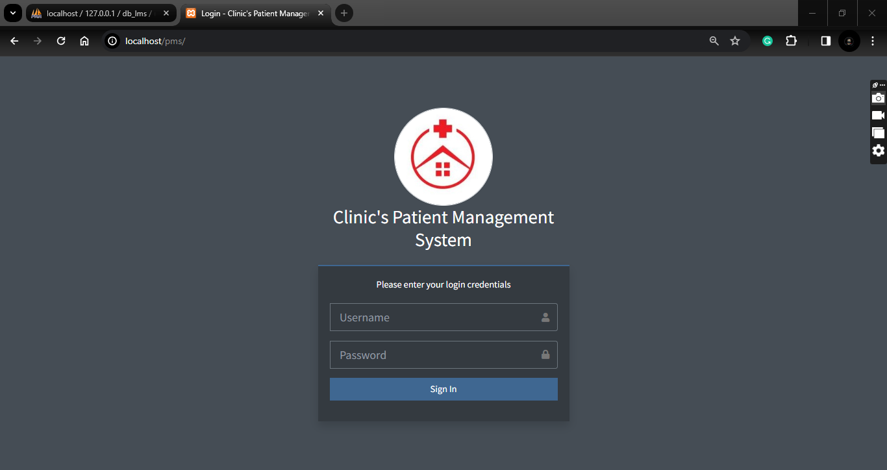
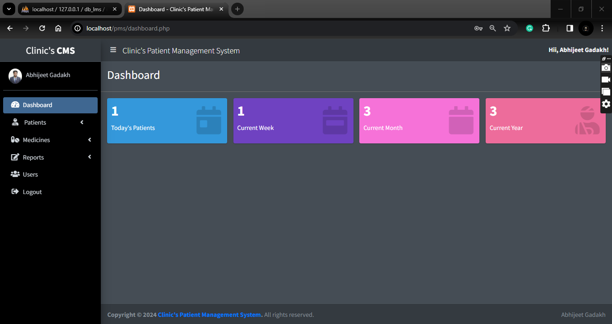

# Clinic Patient Management System

    
## Introduction

This Clinic Patient Management System is a web-based application developed in PHP and MySQL Database. The main purpose is to provide an online and automated platform for managing data for Medical clinics. The system allows easy storage, retrieval, and management of patient visits and prescription records. It features a user-friendly interface with Bootstrap Framework and AdminLTE Template, enhancing the user experience.

## Technologies Used

- XAMPP v3.3.0
- PHP
- MySQL Database
- HTML
- CSS
- JavaScript
- jQuery
- Bootstrap

## Features

- **Dashboard Page**: Display summary information.
- **Medicine Management**: Add, list, and edit medicines.
- **Medicine Details Management**: Manage details of medicines.
- **Patient Management**: Add, list, and edit patient details.
- **Patient's Prescription**: Add prescriptions for patients.
- **Patient's History List**: View and manage patient history.
- **Report Generation**: Generate printable and downloadable reports for patient visits and disease records.
- **User Management**: Add, list, and edit system users.
- **Login and Logout**: Secure access to the system.

## System Snapshots

*Caption: Clinic Patient Management System Login Page*

*Caption: Dashboard of the Clinic Patient Management System*

